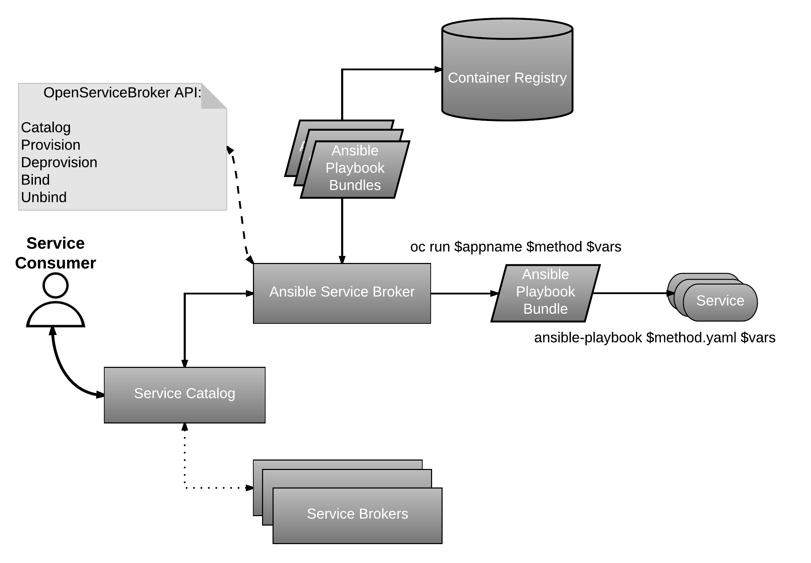
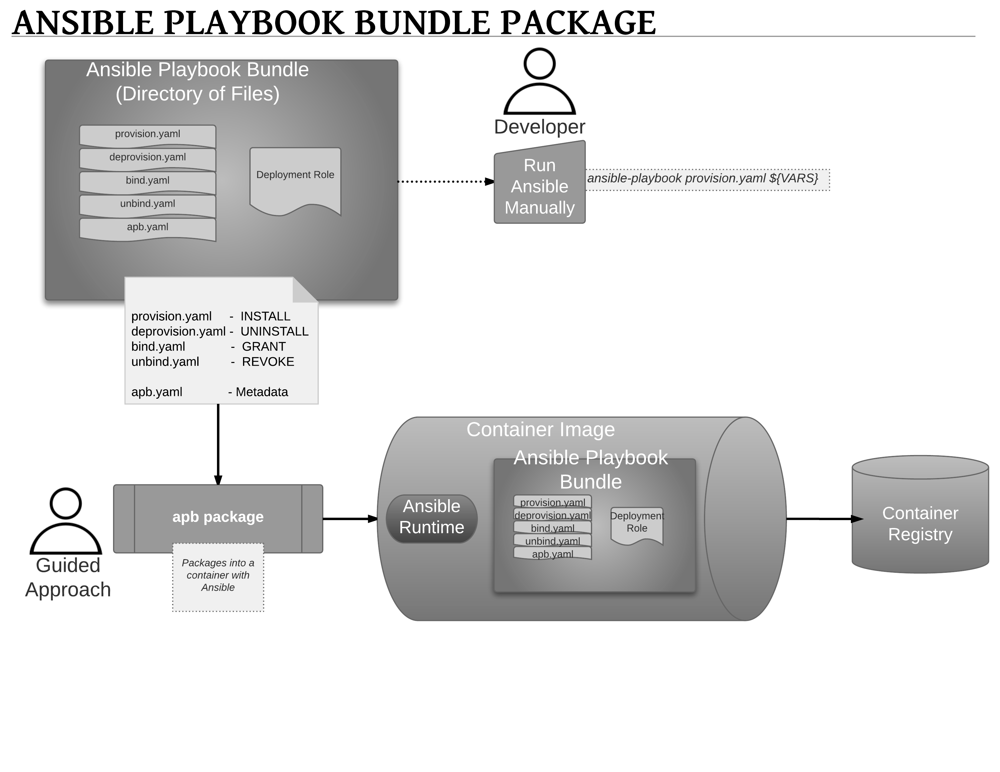

# Introducing Ansible Playbook Bundles and Ansible Service Broker for OpenShift

Ansible Playbook Bundle (APB) is a new method for defining and distributing container applications in OpenShift.
It will leverage Ansible to create a standard path for transitioning from easy to complex deployments. Imagine
you install a prepackaged application on your cluster and then learn you need to customize the deployment to
make it production ready. What if you could peel back the cover in a sense and tweak the packaged files to
satisfy your needs?  Ansible Playbook Bundle is designed to make this transition from simple to complex workflows
possible.

To introduce the Ansible Playbook Bundle concept we will cover:

  1. Service Catalog and Ansible Service Broker workflow
  2. Ansible Playbook Bundle overview
  3. Ansible Playbook Bundle workflow
      - Preparing an Ansible Playbook Bundle
      - Packaging an Ansible Playbook Bundle
      - Deploying an Ansible Playbook Bundle

## Ansible Service Broker

In December 2016 CloudFoundry [announced](https://www.cloudfoundry.org/open-service-broker-api-launches-as-industry-standard/) the open sourcing of its service broker APIs, [Open Service Broker API](https://www.openservicebrokerapi.org/).
The Open Service Broker API defines methods for creating a broker, an entity responsible for delivering
applications or services to a cloud platform. The Ansible Service Broker is a specialized broker created
for OpenShift to manage Ansible Playbook Bundles.

Users will interact with the [Service Catalog](https://github.com/kubernetes-incubator/service-catalog) to obtain a list of available applications and invoke operations
for provisioning, deprovisioning, binding, and unbinding to an application. The Service Catalog will rely on
a collection of brokers to handle details associated with its applications. The diagram below illustrates a
high level concept of the workflow.

### Service Catalog to Service Broker Workflow

  1. User requests list of available applications from the Service Catalog
  2. Service Catalog asks the Ansible Service Broker for available applications
  3. Ansible Service Broker talks to a container registry to learn which APBs are available
  4. User issues a command to provision a specific APB
  5. Provision request makes its way to the Ansible Service Broker which fulfills the command by invoking the
      provision method on the APB

## Ansible Playbook Bundle: Overview

An Ansible Playbook Bundle (APB) borrows several concepts from the [Nulecule](https://github.com/projectatomic/nulecule) or [Atomicapp](http://www.projectatomic.io/docs/atomicapp/) project, namely the concept of a short
lived container with the sole purpose of orchestrating the deployment of the intended application. For the case
of APB, this short lived container is the APB; a container with an Ansible runtime environment
plus any files required to assist in orchestration such as playbooks, roles, and extra dependencies.
Specification of an APB is intended to be lightweight, consisting of several named playbooks and a
metadata file to capture information such as parameters to pass into the application.

The workflow for an APB is broken up into three steps:

  1. Prepare
  2. Package
  3. Deploy

## Ansible Playbook Bundle: Prepare

The first step to creating an APB is preparing the files required to manage the application’s lifecycle.
Two methods of preparing the needed files are supported, a guided approach that uses tooling to handle the
majority of cases and makes the experience easier as well as an advanced approach that allows an experienced
user full control to generate the few required files by hand.

### Guided Approach

The guided approach leverages and extends [ansible-container](https://github.com/ansible/ansible-container) to provide a solution for building all referenced
images, generating a deployment role, and populating the named playbooks an APB requires.

The use of ansible-container allows a user to create yaml files to express image building and container
deployment instructions for multiple environments. A translation step looks at this “single source of truth”
(main.yml) and translates it to a deployment role targeted for a specific platform, in our case of OpenShift
this is powered by the [Kompose](https://github.com/kubernetes-incubator/kompose) project.

As the deployment role is generated from a translation step we recognize that the approach is unlikely to handle
all of the possible use cases for managing applications on OpenShift. The guided approach may be suitable for
many use cases yet an alternative method is needed to address the trickier problems.

### Advanced Approach

As an alternative to the guided approach a user can package an APB reusing their existing ansible playbooks and
roles. Translating a working Ansible deployment role to an APB requires adding a few named playbooks and a
metadata file.

Requirements:
 * provision.yaml
   * Playbook called to handle installing application to the cluster
 * deprovision.yaml
   * Playbook called to handle uninstalling
 * bind.yaml
   * Playbook to grant access to another service to use this service, i.e. generates credentials
 * unbind.yaml
   * Playbook to revoke access to this service
 * apb.yaml
   * Metadata file, exposes parameters the application accepts

The required named playbooks correspond to methods defined by the Open Service Broker API. For example, when the
Ansible Service Broker needs to provision an APB it will execute the provision.yaml.
 
After the required named playbooks have been generated the files can be used directly to test management of the
application. A developer may want to work with this directory of files, make tweaks, run, repeat until they are
happy with the behavior. They can test the playbooks by invoking Ansible directly with the playbook and any
required variables.

## Ansible Playbook Bundle: Package

The packaging step is responsible for building a container image from the named playbooks for distribution.
Packaging combines a base image containing an Ansible runtime with ansible artifacts and any dependencies required
to run the playbooks. The result is a container image with an ENTRYPOINT set to take in several arguments, one of
which is the method to execute, such as provision, deprovision, etc.

## Ansible Playbook Bundle: Deploy

Deploying an APB means invoking the container and passing in the name of the playbook to execute along with any
required variables. It’s possible to invoke the APB directly without going through the Ansible Service Broker.
Each APB is packaged so it’s ENTRYPOINT will invoke ansible when run. The container is intended to be short-lived,
coming up to execute the ansible playbook for managing the application then exiting.
 
In a typical APB deploy, the APB container will provision an application by running the provision.yaml playbook which
executes a deployment role. The deployment role is responsible for creating the OpenShift resources, perhaps through
calling oc create commands or leveraging ansible modules. The end result is that the APB runs Ansible to talk to
OpenShift to orchestrate the provisioning of the intended application.

## Summary

The approach discussed has focused on the methods defined by the Open Service Broker API, yet we are envisioning
additional methods to be added in the future to assist with cases of upgrading, downgrading, testing, verifying, etc.

We are targeting a working demonstration for Red Hat Summit with a deliverable of the Ansible Service Broker in a summer release.

To keep up with developments or to learn more:
 * [Trello](https://trello.com/b/50JhiC5v/ansible-apps)
 * Github
   * [Ansible Playbook Bundle Design Documents](https://github.com/fusor/ansible-playbook-bundle/tree/master/docs)
   * [Ansible Service Broker Code and Design Documents](https://github.com/fusor/ansible-service-broker/blob/master/docs/design.md)
   * [Library of APBs](https://github.com/fusor/apb-examples)
 * IRC
   * Freenode #asbroker
 * [YouTube](https://www.youtube.com/channel/UC04eOMIMiV06_RSZPb4OOBw)
